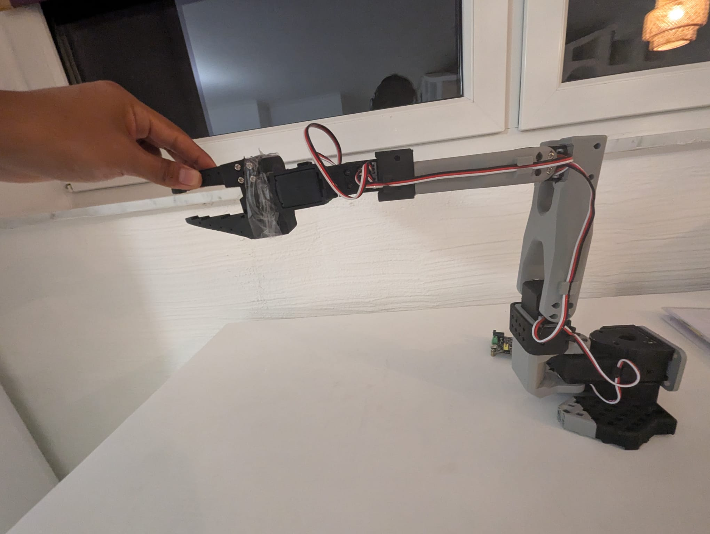
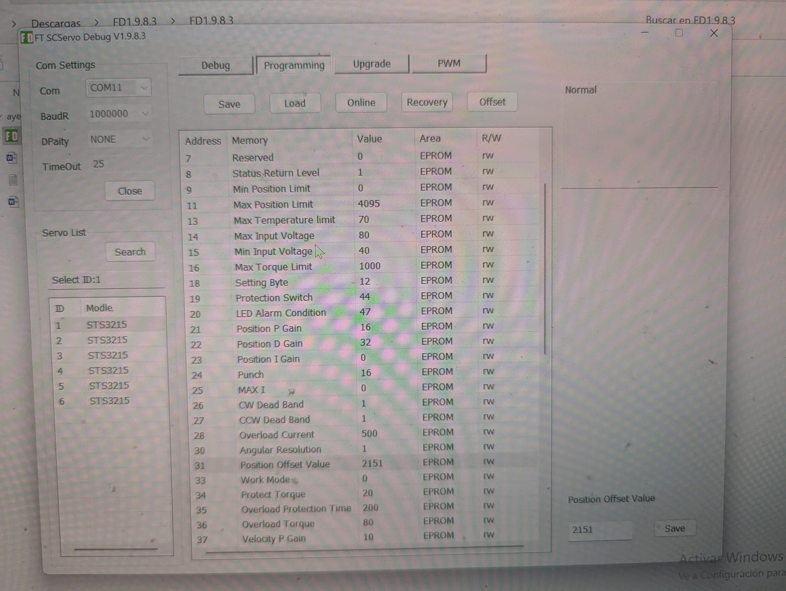
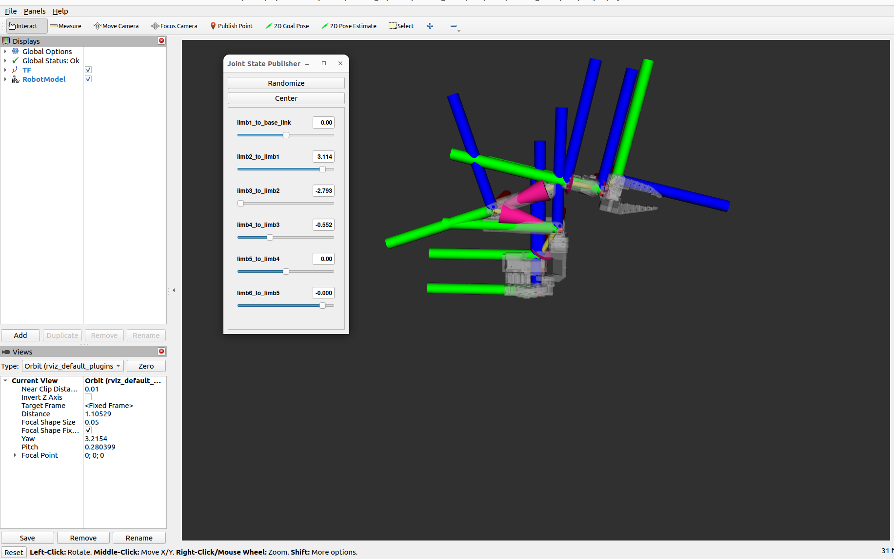
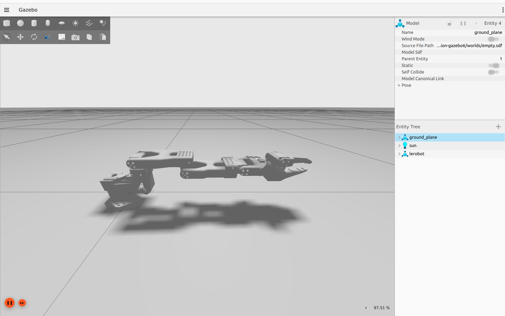
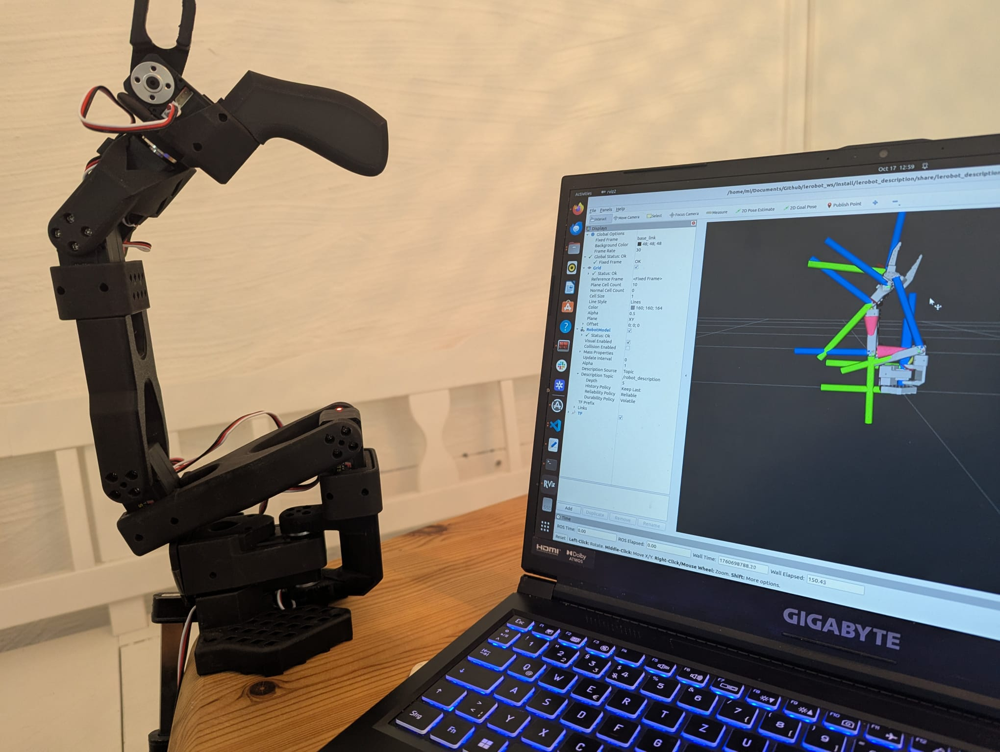
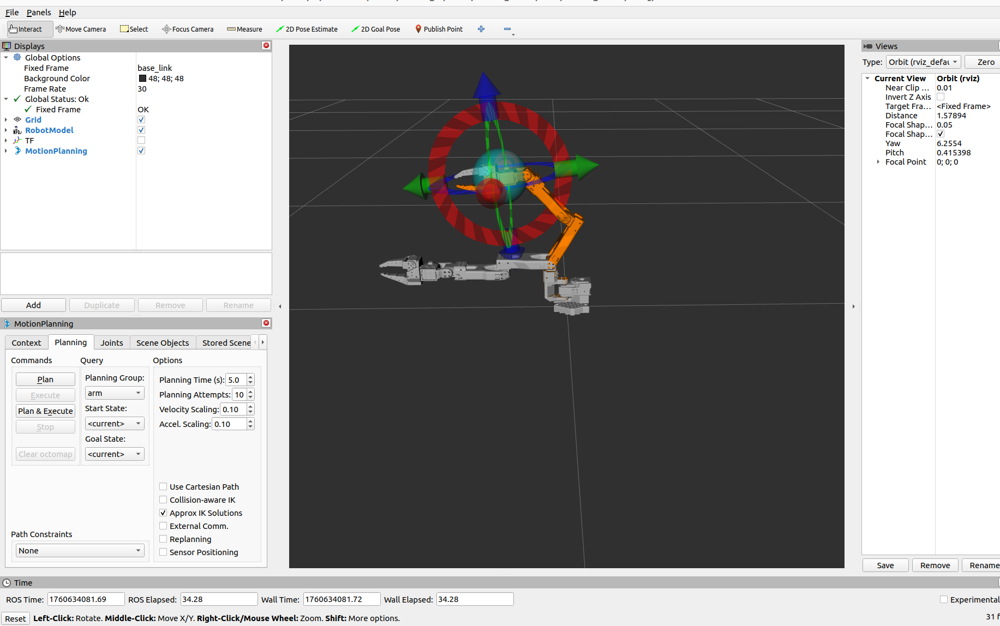
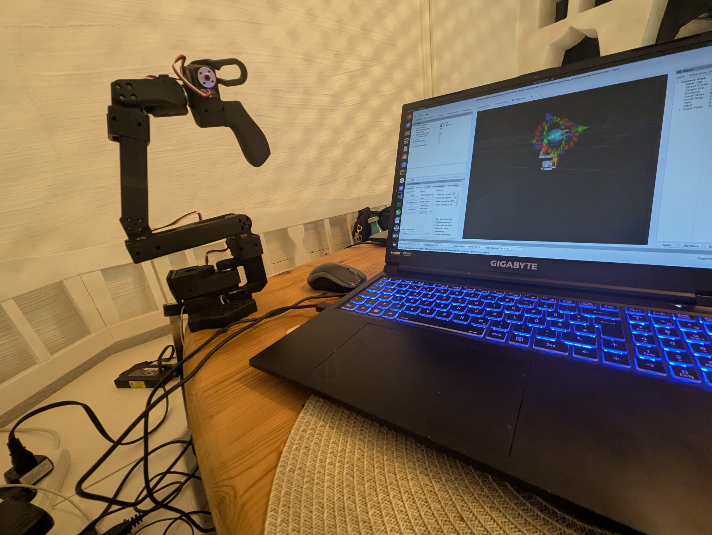

# LeRobot SO101 – Low-Cost 6-DOF Arm

Hallo! 👋  
I'm **Miguel**, and this is an **open-source ROS 2 project** for the low-cost arm robot **SO101**.  
It’s still under development, but I believe it’s time to share it with the community 💪  

---

## Overview

This repository provides the **ROS 2 workspace** for controlling and simulating the SO101 arm.  
It includes:
- URDF/Xacro models for visualization  
- Basic kinematics and control nodes (C++/Python)  
- Launch files for bringing up the robot and testing movement  
- Example configurations for MoveIt and Gazebo (coming soon)

The mechanical frame is based on the work of [AntoBrandi](https://github.com/AntoBrandi), whose open-source designs inspired me to learn by building.

---

## ⚙️ Servo Settings

Before running the robot, set the servo **internal offsets** using the original Feetech software:  
👉 [FeetechRC Software (FD1.9.8.3)](https://www.feetechrc.com/software.html)

Set the servos to the **neutral position**:

```
Joint angles: 0°, 90°, -90°, 0°, 0°, 0°
```
<p align="center">
  
</p>

Change the offset so you can get in this position the next values, otherwise you will have to do extra setting actions.

```
Default values: 2179, 3594, 345, 2354, 2165, 2275
```

<p align="center">
  
</p>

> 

🖼️ *Add image here showing the correct servo positions.*

---

## 🧩 Requirements

Tested on:
- **Ubuntu 22.04**
- **ROS 2 Humble Hawksbill**
- **colcon**, **rviz2**, **gazebo_ros_pkgs**
- **rclcpp**, **geometry_msgs**, **sensor_msgs**

Install the basic dependencies:
```bash
sudo apt update
sudo apt install ros-humble-desktop ros-humble-gazebo-ros-pkgs python3-colcon-common-extensions
```

---

## How to Run

### Demo Robot Limits and joint visualization
```bash
ros2 launch lerobot_description displaz.launch.py is_sim:=true

```
<p align="center">
  
</p>
---

### Simulation with Gazebo
```bash
ros2 launch lerobot_description gazebo.launch.py
ros2 launch lerobot_controller controller.launch.py is_sim:=true mode:=moveit
```
test movement

```ros2 topic pub /arm_controller/joint_trajectory trajectory_msgs/msg/JointTrajectory "{
  joint_names: ['limb1_to_base_link', 'limb2_to_limb1', 'limb3_to_limb2', 'limb4_to_limb3', 'limb5_to_limb4'],
  points: [{
    positions: [0.3, 0.4, -0.2, 0.1, 0.0],
    time_from_start: {sec: 3}
  }]
}"
```
<p align="center">
  
</p>

### Simulation Gazebo and Rviz


```bash
ros2 launch lerobot_description gazebo.launch.py
ros2 launch lerobot_controller controller.launch.py is_sim:=true mode:=moveit
ros2 launch lerobot_description rviz.launch.py is_sim:=true
```

---


### Real Robot Controller

For running the **real robot** (connected via `/dev/ttyACM0`, baudrate `1000000`):

```bash
ros2 launch lerobot_controller controller.launch.py sim:=False
```
<p align="center">
  
</p>
---

### Motion Planning with MoveIt

**Real robot:** it depends in which mode you would like to work is_sim:true (simulation) is_sim: false (real robot)
```bash
ros2 launch lerobot_moveit moveit.launch.py
```
<p align="center">
  
</p>

<p align="center">
  
</p>

## Under Development

Some modules are still being integrated:
```bash
ros2 launch lerobot_bringup simulated_robot.launch.py
./ngrok http 5000

lerobot_cpp_examples/scripts/lero_ik
lerobot_cpp_exmaples/scripts/lero_dk

```

---

## 🧱 Repository Structure

```
lerobot_ws/
├── src/
│   ├── lerobot_description/     # URDF, meshes, RViz launch
│   ├── lerobot_controller/      # Nodes for motion control
│   ├── lerobot_cpp_examples/    # C++ kinematics examples
│   ├── lerobot_brinup/    	 # Robot + alexa commands
│   ├── lerobot_cpp_examples/    # C++ kinematics examples
│   ├── lerobot_moveit		 # Robot Motion planner
│   ├── lerobot_cpp_examples/    # C++ kinematics examples
│   └── lerobot_remoto		 # Alexa Interface
├── README.md
└── .gitignore
```

---

## Credits

Frame design and inspiration: [AntoBrandi](https://github.com/AntoBrandi)  
Development and adaptation: **Miguel Encarnacion**

---

## 📬 Contact

If you’d like to collaborate, test, or improve this project:  
**GitHub:** [MiguelPalacios2504](https://github.com/MiguelPalacios2504)
